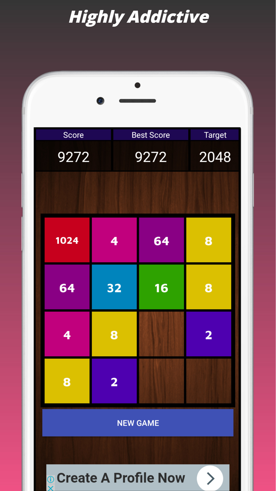
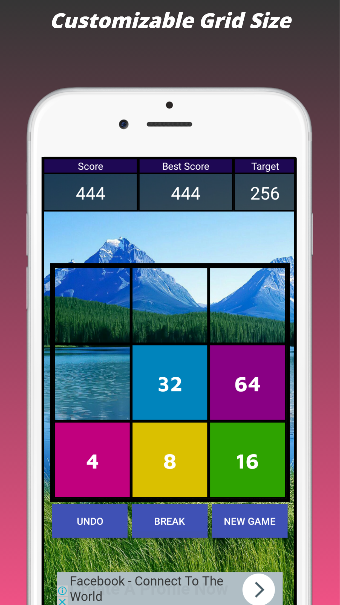
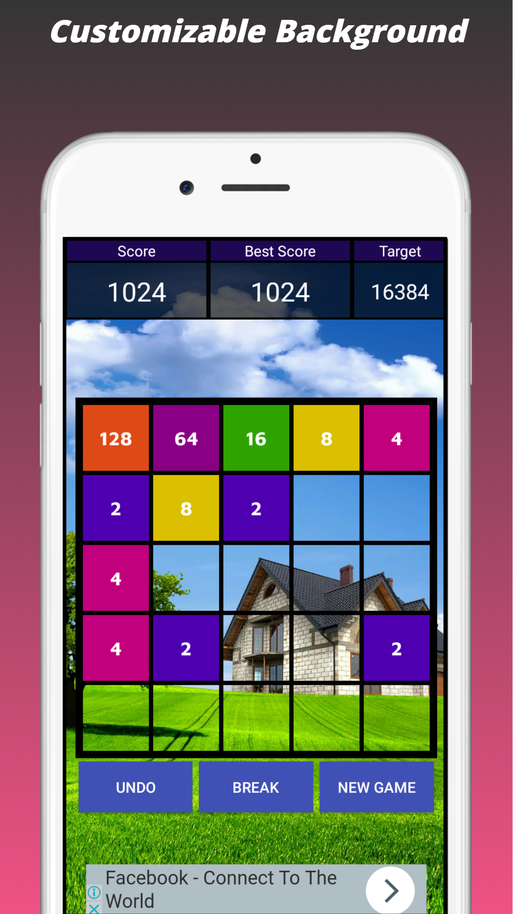
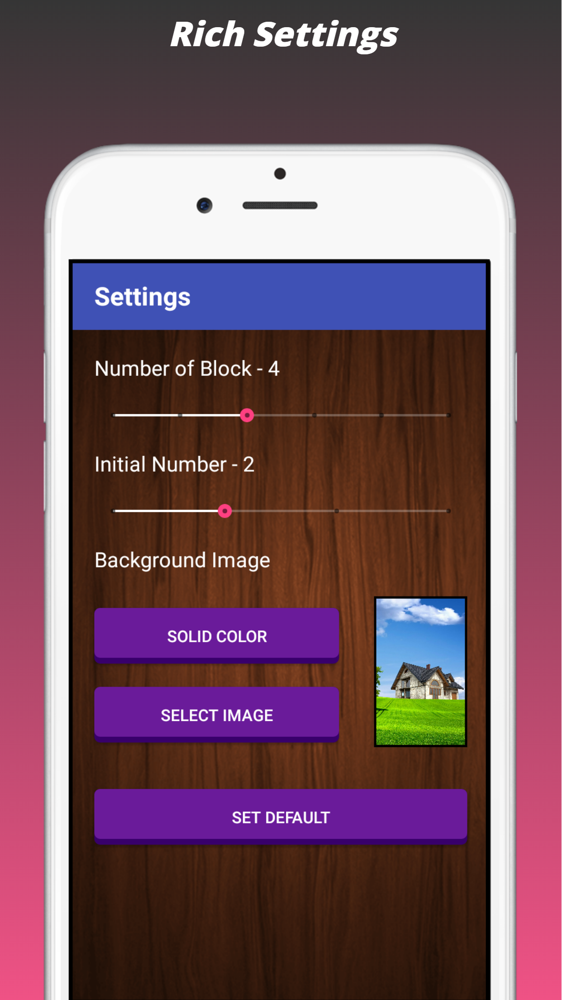
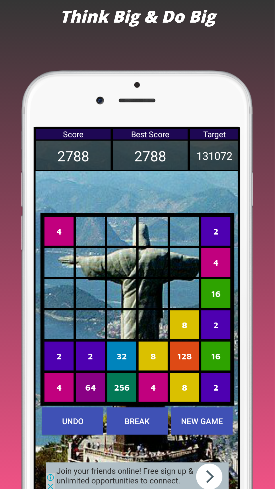

2048 Time Killer
======
**2048 Time Killer** is based on a personality test suggested by Dalai Lama. Just by answering 3 questions, know yourself in a much better way....

#### Screenshot

</img>
</img>
</img>
</img>
</img>
</img>

#### App Stores
<!-- edit this image location -->

#### Works on
* Android 4.1.0 (Jelly Bean) and above

### Permissions
* Does not require any special permission

### Built With

* [Android Studio](https://developer.android.com/studio/index.html) - The Official IDE for Android

### Authors

* **Shivam Agrawal** - [Rising Hope](http://risinghopeapps.weebly.com/)

### Version 
* Version 2.1.1

## License 
* see [LICENSE](/LICENSE) file
